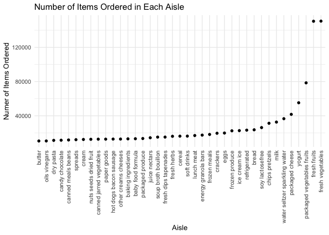

Homework 3
================
Fiona Ehrich

``` r
library(tidyverse)
library(p8105.datasets)

knitr::opts_chunk$set(
    fig.width = 6, 
  fig.asp = .6,
  out.width = "90%"
)
theme_set(theme_minimal() + theme(legend.position = "bottom"))
options(
  ggplot2.continuous.colour = "viridis",
  ggplot2.continuous.fill = "viridis"
)
scale_colour_discrete = scale_colour_viridis_d
scale_fill_discrete = scale_fill_viridis_d
```

## Problem 1

``` r
data("instacart")
```

This datasets contains 1384617 rows and 15 columns. Observations are the
level of items in orders by user. There are user / order variables –
user ID, order ID, order day, and order hour. There are also item
variables – name, aisle, department, and some numeric codes. There are
various aisles within a given department.

There are 134 aisles. The table below shows that most items are from the
following aisles: “fresh vegetables”, “fresh fruits”, and “packaged
vegetables fruits”.

``` r
instacart %>% 
  count(aisle) %>% 
  arrange(desc(n))
```

    ## # A tibble: 134 x 2
    ##    aisle                              n
    ##    <chr>                          <int>
    ##  1 fresh vegetables              150609
    ##  2 fresh fruits                  150473
    ##  3 packaged vegetables fruits     78493
    ##  4 yogurt                         55240
    ##  5 packaged cheese                41699
    ##  6 water seltzer sparkling water  36617
    ##  7 milk                           32644
    ##  8 chips pretzels                 31269
    ##  9 soy lactosefree                26240
    ## 10 bread                          23635
    ## # … with 124 more rows

Below is a plot that shows the number of items ordered in each aisle,
limited to aisles with more than 10000 items ordered.

``` r
instacart %>% 
    count(aisle) %>% 
    filter(n > 10000) %>% 
    mutate(
        aisle = factor(aisle),
        aisle = fct_reorder(aisle, n)
    ) %>% 
    ggplot(aes(x = aisle, y = n)) + 
    geom_point() + 
    theme(axis.text.x = element_text(angle = 90, vjust = 0.5, hjust = 1))
```



Below is a table showing the three most popular items in each of the
aisles “baking ingredients”, “dog food care”, “packaged vegetables
fruits”.

``` r
instacart %>% 
    filter(aisle %in% c("baking ingredients", "dog food care", "packaged vegetables fruits")) %>% 
    group_by(aisle) %>% 
    count(product_name) %>% 
    mutate(rank = min_rank(desc(n))) %>% 
    filter(rank < 4) %>% 
    arrange(aisle, rank) %>% 
    knitr::kable()
```

| aisle                      | product\_name                                 |    n | rank |
| :------------------------- | :-------------------------------------------- | ---: | ---: |
| baking ingredients         | Light Brown Sugar                             |  499 |    1 |
| baking ingredients         | Pure Baking Soda                              |  387 |    2 |
| baking ingredients         | Cane Sugar                                    |  336 |    3 |
| dog food care              | Snack Sticks Chicken & Rice Recipe Dog Treats |   30 |    1 |
| dog food care              | Organix Chicken & Brown Rice Recipe           |   28 |    2 |
| dog food care              | Small Dog Biscuits                            |   26 |    3 |
| packaged vegetables fruits | Organic Baby Spinach                          | 9784 |    1 |
| packaged vegetables fruits | Organic Raspberries                           | 5546 |    2 |
| packaged vegetables fruits | Organic Blueberries                           | 4966 |    3 |

Below is a table showing the mean hour of the day at which Pink Lady
Apples and Coffee Ice Cream are ordered on each day of the week.

``` r
instacart %>% 
  filter(product_name %in% c("Pink Lady Apples", "Coffee Ice Cream")) %>% 
  group_by(product_name, order_dow) %>% 
  summarize(mean_hour = mean(order_hour_of_day)) %>% 
  pivot_wider(
    names_from = order_dow,
    values_from = mean_hour
  ) %>% 
  knitr::kable()
```

| product\_name    |        0 |        1 |        2 |        3 |        4 |        5 |        6 |
| :--------------- | -------: | -------: | -------: | -------: | -------: | -------: | -------: |
| Coffee Ice Cream | 13.77419 | 14.31579 | 15.38095 | 15.31818 | 15.21739 | 12.26316 | 13.83333 |
| Pink Lady Apples | 13.44118 | 11.36000 | 11.70213 | 14.25000 | 11.55172 | 12.78431 | 11.93750 |

## Problem 2

Load, tidy, and otherwise wrangle the data.

``` r
accel =
  read_csv(
    "./data/accel_data.csv",
    col_types = cols( # I am making sure these variables are in appropriate classes
      week = col_factor(),
      day_id = col_factor(),
      day = col_factor()
      )
    ) %>% 
  janitor::clean_names() %>% 
  pivot_longer( # Making the dataset more tidy
    activity_1:activity_1440,
    names_to = "minute",
    names_prefix = "activity_",
    names_transform = list(minute = as.numeric), # Making the minute variable numeric
    values_to = "activity",
    ) %>% 
  mutate(
    day_type = 
      as.factor(
        ifelse(day == c("Saturday", "Sunday"), "weekend", "weekday")
        )
    )
```

The resulting dataset has 50400 rows and 6 columns. The variables are:
week, day\_id, day, minute, activity, day\_type. This dataset is now
tidier than it was originally; each activity observation now exists on
its own row.
