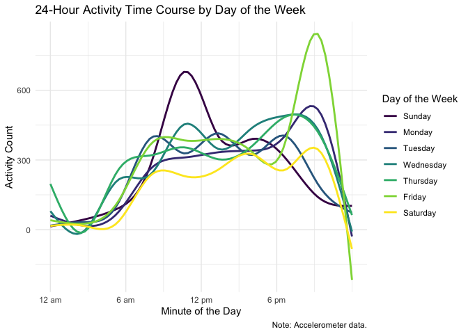
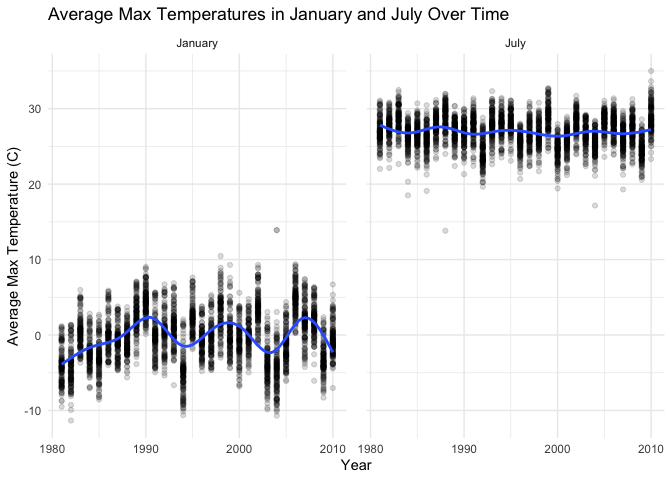

Homework 3
================
Fiona Ehrich

## Problem 1

``` r
data("instacart")
```

This datasets contains 1384617 rows and 15 columns. Observations are the
level of items in orders by user. There are user / order variables –
user ID, order ID, order day, and order hour. There are also item
variables – name, aisle, department, and some numeric codes. There are
various aisles within a given department.

There are 134 aisles. The table below shows that most items are from the
following aisles: “fresh vegetables”, “fresh fruits”, and “packaged
vegetables fruits”.

``` r
instacart %>% 
  count(aisle) %>% 
  arrange(desc(n))
```

    ## # A tibble: 134 x 2
    ##    aisle                              n
    ##    <chr>                          <int>
    ##  1 fresh vegetables              150609
    ##  2 fresh fruits                  150473
    ##  3 packaged vegetables fruits     78493
    ##  4 yogurt                         55240
    ##  5 packaged cheese                41699
    ##  6 water seltzer sparkling water  36617
    ##  7 milk                           32644
    ##  8 chips pretzels                 31269
    ##  9 soy lactosefree                26240
    ## 10 bread                          23635
    ## # … with 124 more rows

Below is a plot that shows the number of items ordered in each aisle,
limited to aisles with more than 10000 items ordered.

``` r
instacart %>% 
    count(aisle) %>% 
    filter(n > 10000) %>% 
    mutate(
        aisle = factor(aisle),
        aisle = fct_reorder(aisle, n)
    ) %>% 
    ggplot(aes(x = aisle, y = n)) + 
    geom_point() + 
    theme(axis.text.x = element_text(angle = 90, vjust = 0.5, hjust = 1))
```


Below is a table showing the three most popular items in each of the
aisles “baking ingredients”, “dog food care”, “packaged vegetables
fruits”.

``` r
instacart %>% 
    filter(aisle %in% c("baking ingredients", "dog food care", "packaged vegetables fruits")) %>% 
    group_by(aisle) %>% 
    count(product_name) %>% 
    mutate(rank = min_rank(desc(n))) %>% 
    filter(rank < 4) %>% 
    arrange(aisle, rank) %>% 
    knitr::kable()
```

| aisle                      | product\_name                                 |    n | rank |
| :------------------------- | :-------------------------------------------- | ---: | ---: |
| baking ingredients         | Light Brown Sugar                             |  499 |    1 |
| baking ingredients         | Pure Baking Soda                              |  387 |    2 |
| baking ingredients         | Cane Sugar                                    |  336 |    3 |
| dog food care              | Snack Sticks Chicken & Rice Recipe Dog Treats |   30 |    1 |
| dog food care              | Organix Chicken & Brown Rice Recipe           |   28 |    2 |
| dog food care              | Small Dog Biscuits                            |   26 |    3 |
| packaged vegetables fruits | Organic Baby Spinach                          | 9784 |    1 |
| packaged vegetables fruits | Organic Raspberries                           | 5546 |    2 |
| packaged vegetables fruits | Organic Blueberries                           | 4966 |    3 |

Below is a table showing the mean hour of the day at which Pink Lady
Apples and Coffee Ice Cream are ordered on each day of the week.

``` r
instacart %>% 
  filter(product_name %in% c("Pink Lady Apples", "Coffee Ice Cream")) %>% 
  group_by(product_name, order_dow) %>% 
  summarize(mean_hour = mean(order_hour_of_day)) %>% 
  pivot_wider(
    names_from = order_dow,
    values_from = mean_hour
  ) %>% 
  knitr::kable()
```

| product\_name    |        0 |        1 |        2 |        3 |        4 |        5 |        6 |
| :--------------- | -------: | -------: | -------: | -------: | -------: | -------: | -------: |
| Coffee Ice Cream | 13.77419 | 14.31579 | 15.38095 | 15.31818 | 15.21739 | 12.26316 | 13.83333 |
| Pink Lady Apples | 13.44118 | 11.36000 | 11.70213 | 14.25000 | 11.55172 | 12.78431 | 11.93750 |

## Problem 2

Load, tidy, and otherwise wrangle the data.

``` r
accel =
  read_csv(
    "./data/accel_data.csv",
    col_types = cols( # I am making sure these variables are in appropriate classes
      week = col_factor(),
      day_id = col_factor(),
      day = col_factor()
      )
    ) %>% 
  janitor::clean_names() %>% 
  pivot_longer( # Making the dataset more tidy
    activity_1:activity_1440,
    names_to = "minute",
    names_prefix = "activity_",
    names_transform = list(minute = as.numeric), # Making the minute variable numeric
    values_to = "activity",
    ) %>% 
  mutate(
    day = forcats::fct_relevel(day,c("Sunday", "Monday", "Tuesday", "Wednesday", "Thursday", "Friday", "Saturday")), # Putting the day of the week factors in a sensible order
    day_type = # Making a new variable to indicate whether weekend or weekday
      as.factor(
        ifelse(day == c("Saturday", "Sunday"), "weekend", "weekday")
        )
    )
```

The resulting dataset has 50400 rows and 6 columns. The variables are:
week, day\_id, day, minute, activity, day\_type. This dataset is now
tidier than it was originally; each activity observation now exists on
its own row.

Now, I will aggregate across minutes to create a total activity for each
day. Below is a table that displays the total activity for each day in
chronological order (I sorted first by week and then by day of the
week). I put this table into a “wider” format so it is easier to read.

``` r
accel %>% 
  group_by(week, day) %>% 
  summarize(total_activity = sum(activity)) %>% 
  pivot_wider(
    names_from = day,
    values_from = total_activity) %>% 
  knitr::kable()
```

| week | Sunday |    Monday |  Tuesday | Wednesday | Thursday |   Friday | Saturday |
| :--- | -----: | --------: | -------: | --------: | -------: | -------: | -------: |
| 1    | 631105 |  78828.07 | 307094.2 |    340115 | 355923.6 | 480542.6 |   376254 |
| 2    | 422018 | 295431.00 | 423245.0 |    440962 | 474048.0 | 568839.0 |   607175 |
| 3    | 467052 | 685910.00 | 381507.0 |    468869 | 371230.0 | 467420.0 |   382928 |
| 4    | 260617 | 409450.00 | 319568.0 |    434460 | 340291.0 | 154049.0 |     1440 |
| 5    | 138421 | 389080.00 | 367824.0 |    445366 | 549658.0 | 620860.0 |     1440 |

It is hard to see any particular trends from this table alone. Just for
my own knowledge, I created a “longer” version of this table and sorted
from highest to lowest total activity per day (below). I can see that
the maximum total activity per day is 685910.00 and the minimum total
activity per day is 1440.00 (and I can see how each day ranks in terms
of total activity).

``` r
accel %>% 
  group_by(week, day) %>% 
  summarize(total_activity = sum(activity)) %>% 
  arrange(desc(total_activity)) %>% 
  knitr::kable()
```

| week | day       | total\_activity |
| :--- | :-------- | --------------: |
| 3    | Monday    |       685910.00 |
| 1    | Sunday    |       631105.00 |
| 5    | Friday    |       620860.00 |
| 2    | Saturday  |       607175.00 |
| 2    | Friday    |       568839.00 |
| 5    | Thursday  |       549658.00 |
| 1    | Friday    |       480542.62 |
| 2    | Thursday  |       474048.00 |
| 3    | Wednesday |       468869.00 |
| 3    | Friday    |       467420.00 |
| 3    | Sunday    |       467052.00 |
| 5    | Wednesday |       445366.00 |
| 2    | Wednesday |       440962.00 |
| 4    | Wednesday |       434460.00 |
| 2    | Tuesday   |       423245.00 |
| 2    | Sunday    |       422018.00 |
| 4    | Monday    |       409450.00 |
| 5    | Monday    |       389080.00 |
| 3    | Saturday  |       382928.00 |
| 3    | Tuesday   |       381507.00 |
| 1    | Saturday  |       376254.00 |
| 3    | Thursday  |       371230.00 |
| 5    | Tuesday   |       367824.00 |
| 1    | Thursday  |       355923.64 |
| 4    | Thursday  |       340291.00 |
| 1    | Wednesday |       340115.01 |
| 4    | Tuesday   |       319568.00 |
| 1    | Tuesday   |       307094.24 |
| 2    | Monday    |       295431.00 |
| 4    | Sunday    |       260617.00 |
| 4    | Friday    |       154049.00 |
| 5    | Sunday    |       138421.00 |
| 1    | Monday    |        78828.07 |
| 4    | Saturday  |         1440.00 |
| 5    | Saturday  |         1440.00 |

I am now making a plot that shows the 24-hour activity time courses for
each day.

``` r
accel %>% 
  ggplot(aes(x = minute, y = activity, color = day)) + 
  geom_smooth(se = FALSE) +
  labs(
    title = "24-Hour Activity Time Course by Day of the Week (Accelerometer Data)",
    x = "Minute of the Day",
    y = "Activity Count",
    color = "Day of the Week"
  ) +
  scale_x_continuous(
    breaks = c(1, 361, 721, 1081),
    labels = c("12 am", "6 am", "12 pm", "6 pm")
  )
```



From this plot, I can see that activity tends to be lower at night
(presumably while the person wearing the accelerometer is resting or
sleeping) and higher during the day. I also notice some peaks in
activity on Sunday late mornings and on Friday evenings. I think that
these peaks could correspond to some of this person’s regular, weekly
activities (for example, going out on the town on Friday nights\!).

## Problem 3

``` r
data("ny_noaa")
```

This dataset contains 2595176 rows and 7 columns. The variable names are
id, date, prcp, snow, snwd, tmax, tmin. Essentially, each row contains
various weather-related observations for a given weather station on a
given day (precipitation, snowfall, snow depth, maximum temperature,
minimum temperature). By using the summary function (output below), we
can see there is data missing for all five of the weather-related
variables.

``` r
ny_noaa %>% 
  mutate( # I am just quickly making tmax and tmin numeric here so that the summary displays properly
    tmax = as.numeric(tmax),
    tmin = as.numeric(tmin)
  ) %>% 
  summary()
```

    ##       id                 date                 prcp               snow       
    ##  Length:2595176     Min.   :1981-01-01   Min.   :    0.00   Min.   :  -13   
    ##  Class :character   1st Qu.:1988-11-29   1st Qu.:    0.00   1st Qu.:    0   
    ##  Mode  :character   Median :1997-01-21   Median :    0.00   Median :    0   
    ##                     Mean   :1997-01-01   Mean   :   29.82   Mean   :    5   
    ##                     3rd Qu.:2005-09-01   3rd Qu.:   23.00   3rd Qu.:    0   
    ##                     Max.   :2010-12-31   Max.   :22860.00   Max.   :10160   
    ##                                          NA's   :145838     NA's   :381221  
    ##       snwd             tmax              tmin        
    ##  Min.   :   0.0   Min.   :-389.0    Min.   :-594.0   
    ##  1st Qu.:   0.0   1st Qu.:  50.0    1st Qu.: -39.0   
    ##  Median :   0.0   Median : 150.0    Median :  33.0   
    ##  Mean   :  37.3   Mean   : 139.8    Mean   :  30.3   
    ##  3rd Qu.:   0.0   3rd Qu.: 233.0    3rd Qu.: 111.0   
    ##  Max.   :9195.0   Max.   : 600.0    Max.   : 600.0   
    ##  NA's   :591786   NA's   :1134358   NA's   :1134420

To get arough sense of the extent of this missing data, the following
are the proportions of missing data relative to the total number of rows
(I evaluated this for each of the weather-related variables): 0.0561958
for precipitation, 0.146896 for snowfall, 0.2280331 for snow depth,
0.4371025 for maximum temperature, and 0.4371264 for minimum
temperature. These values confirm that there is quite a bit of missing
data in this dataset, particularly for the temperature variables.

Now, I will clean the data. I am splitting up the date variable, making
sure variables are in appropriate classes, and converting certain
variables to more appropriate units.

``` r
ny_noaa_tidy =
  ny_noaa %>%
  separate(date, into = c("year", "month", "day"), sep = "-") %>% # Separating the date variable
   mutate(
     year = as.integer(year), # Correcting the variable classes
     month = as.integer(month),
     day = as.integer(day),
     tmax = (as.numeric(tmax))/10, # Converting this into degrees C rather than tenths of degrees C
     tmin = (as.numeric(tmin))/10, # Converting this into degrees C rather than tenths of degrees C
     prcp = prcp/10 # Converting this into mm rather than tenths of mm
   )
```

The table below shows the most commonly observed values. We can see that
0 is the most commonly observed value. This makes sense as snow does not
typically occur in NY for a majority of the months.

``` r
ny_noaa_tidy %>% 
  count(snow) %>% 
  arrange(desc(n))
```

    ## # A tibble: 282 x 2
    ##     snow       n
    ##    <int>   <int>
    ##  1     0 2008508
    ##  2    NA  381221
    ##  3    25   31022
    ##  4    13   23095
    ##  5    51   18274
    ##  6    76   10173
    ##  7     8    9962
    ##  8     5    9748
    ##  9    38    9197
    ## 10     3    8790
    ## # … with 272 more rows

Below is a plot showing the average max temperature in January and in
July in each station across years. As one would expect, the max
temperatures in January tend to be much lower than those in July. From
year to year, the January values appear to fluctuate more than the July
values, which appear more steady. I do notice some outliers - for
example, an unusually high value in the January panel and several
unusually low values in the July panel.

``` r
month_labels = c(`1` = "January", `7` = "July")

ny_noaa_tidy %>% 
  filter(month == c("1", "7")) %>% 
  group_by(id, month, year) %>% 
  summarize(mean_tmax = mean(tmax, na.rm = TRUE)) %>% 
  ggplot(aes(x = year, y = mean_tmax)) +
  geom_point(alpha = .2) +
  geom_smooth(se = FALSE) +
  facet_grid(. ~ month, labeller = as_labeller(month_labels)) +
  labs(
    title = "Average Max Temperatures in January and July Over Time",
    x = "Year",
    y = "Average Max Temperature (C)"
  ) 
```

    ## `summarise()` regrouping output by 'id', 'month' (override with `.groups` argument)

    ## `geom_smooth()` using method = 'gam' and formula 'y ~ s(x, bs = "cs")'

    ## Warning: Removed 5972 rows containing non-finite values (stat_smooth).

    ## Warning: Removed 5972 rows containing missing values (geom_point).


